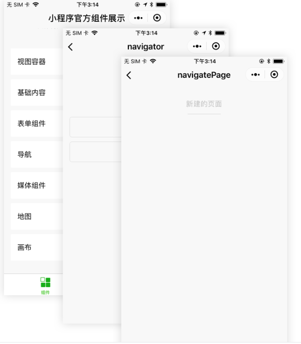

# 微信小程序

## Tips

### 生命周期

#### App

> 整个小程序只有一个 App 实例，是全部页面共享的

+ onLaunch

  + options 参数有
  
    >  onLaunch,onShow参数
  
    | 字段                   | 类型   | 描述                                                    |
    | :--------------------- | :----- | :------------------------------------------------------ |
    | path                   | String | 打开小程序的页面路径                                    |
    | query                  | Object | 打开小程序的页面参数query                               |
    | scene                  | Number | 打开小程序的场景值，详细场景值请参考小程序官方文档      |
    | shareTicket            | String | shareTicket，详见小程序官方文档                         |
    | referrerInfo           | Object | 当场景为由从另一个小程序或公众号或App打开时，返回此字段 |
    | referrerInfo.appId     | String | 来源小程序或公众号或App的 appId，详见下方说明           |
    | referrerInfo.extraData | Object | 来源小程序传过来的数据，scene=1037或1038时支持          |
  
  ```javascript
  App({
    onLaunch: function (options) {
      // 小程序启动之后 触发
    }
  })
  ```
  
+ `onShow`

  ```javascript
  App({
    // 场景值
    onLaunch: function(options) { console.log(options) },
    onShow: function(options) { console.log(options) }
  })
  
  ```

  

 App构造器的参数

| 参数属性 | 类型     | 描述                                                         |
| :------- | :------- | :----------------------------------------------------------- |
| onLaunch | Function | 当小程序初始化完成时，会触发 onLaunch（全局只触发一次）      |
| onShow   | Function | 当小程序启动，或从后台进入前台显示，会触发 onShow<br />进入小程序之后，用户可以点击右上角的关闭，或者按手机设备的Home键离开小程序，此时小程序并没有被直接销毁 |
| onHide   | Function | 当小程序从前台进入后台，会触发 onHide                        |
| onError  | Function | 当小程序发生脚本错误，或者 API 调用失败时，会触发 onError 并带上错误信息 |
| 其他字段 | 任意     | 可以添加任意的函数或数据到 Object 参数中，在App实例回调用 this 可以访问 |

#### Page

```javascript
Page({
  data: { text: "This is page data." },
  // onLoad在页面没被销毁之前只会触发1次，在onLoad的回调中，可以获取当前页面所调用的		// 打开参数option
  onLoad: function(options) { },
  // Page构造器参数所定义的onReady方法会被调用，onReady在页面没被销毁前只会触发1次，	// onReady触发时，表示页面已经准备妥当，在逻辑层就可以和视图层进行交互了
  onReady: function() { },
  // 页面显示之后，Page构造器参数所定义的onShow方法会被调用，一般从别的页面返回到当前  	// 页面时，当前页的onShow方法都会被调用
  onShow: function() { },
  // 页面不可见时，Page构造器参数所定义的onHide方法会被调用，这种情况会在使用				// wx.navigateTo切换到其他页面、底部tab切换时触发。
  onHide: function() { },
  // 当前页面使用wx.redirectTo或wx.navigateBack返回到其他页时，当前页面会被微信客	   // 户端销毁回收，此时Page构造器参数所定义的onUnload方法会被调用。
  onUnload: function() { },
  // 监听用户下拉刷新事件，需要在app.json的window选项中或页面配置page.json中设置		// enablePullDownRefresh为true。当处理完数据刷新后，wx.stopPullDownRefresh可	 // 以停止当前页面的下拉刷新。
  onPullDownRefresh: function() { },
  // 监听用户上拉触底事件。可以在app.json的window选项中或页面配置page.json中设置触		// 发距离onReachBottomDistance。在触发距离内滑动期间，本事件只会被触发一次。
  onReachBottom: function() { },
  // 只有定义了此事件处理函数，右上角菜单才会显示“转发”按钮，在用户点击转发按钮的时候会	 // 调用，此事件需要return一个Object，包含title和path两个字段，用于自定义转发内容
  onShareAppMessage: function () {
    	return {
       title: '自定义转发标题',
       path: '/page/user?id=123'
     }
  },
  // 参数为 Object，包含 scrollTop 字段，表示页面在垂直方向已滚动的距离（单位px）。
  onPageScroll: function() { }
})
```

 Page构造器的参数

| 参数属性          | 类型     | 描述                                                         |
| :---------------- | :------- | :----------------------------------------------------------- |
| data              | Object   | 页面的初始数据                                               |
| onLoad            | Function | 生命周期函数--监听页面加载，触发时机早于onShow和onReady      |
| onReady           | Function | 生命周期函数--监听页面初次渲染完成                           |
| onShow            | Function | 生命周期函数--监听页面显示，触发事件早于onReady              |
| onHide            | Function | 生命周期函数--监听页面隐藏                                   |
| onUnload          | Function | 生命周期函数--监听页面卸载                                   |
| onPullDownRefresh | Function | 页面相关事件处理函数--监听用户下拉动作                       |
| onReachBottom     | Function | 页面上拉触底事件的处理函数                                   |
| onShareAppMessage | Function | 用户点击右上角转发                                           |
| onPageScroll      | Function | 页面滚动触发事件的处理函数                                   |
| 其他              | Any      | 可以添加任意的函数或数据，在Page实例的其他函数中用 this 可以访问 |

### 列表渲染

#### 使用默认的item和index

```javascript
<!-- array 是一个数组 -->
<view wx:for="{{array}}">
  {{index}}: {{item.message}}
</view>

<!-- 对应的脚本文件
Page({
  data: {
    array: [{
      message: 'foo',
    }, {
      message: 'bar'
    }]
  }
})
-->
```

### wxml

> wxml根本就没有根节点的概念呀
>
> 一个wxml文件不必非要一个元素来包裹

### wxss

+ **[ui样式库](https://github.com/Tencent/weui-wxss)**

> 项目公共样式：根目录中的app.wxss为项目公共样式，它会被注入到小程序的每个页面。
>
> 页面样式：与app.json注册过的页面同名且位置同级的WXSS文件。

#### wxss 的引用

+ `@import url('./test_0.css')`

  > 这种方法在请求上不会把test_0.css合并到index.css中，也就是请求index.css的时候，会多一个test_0.css的请求。

+ `@import './test_0.wxss'`

  > 由于WXSS最终会被编译打包到目标文件中，用户只需要下载一次，在使用过程中不会因为样式的引用而产生多余的文件请求。

#### 内联样式

WXSS内联样式与Web开发一致:

```html
<!--index.wxml-->

<!--内联样式-->
<view style="color: red; font-size: 48rpx"></view>
```

小程序支持动态更新内联样式：

```html
<!--index.wxml-->

<!--可动态变化的内联样式-->
<!--
{
  eleColor: 'red',
  eleFontsize: '48rpx'
}
-->
<view style="color: {{eleColor}}; font-size: {{eleFontsize}}"></view>
```

#### 选择器

表2-2 小程序WXSS支持的选择器

| **类型**     | **选择器** | **样例**      | **样例描述**                                   |
| :----------- | :--------- | :------------ | :--------------------------------------------- |
| 类选择器     | .class     | .intro        | 选择所有拥有 class="intro" 的组件              |
| id选择器     | #id        | #firstname    | 选择拥有 id="firstname" 的组件                 |
| 元素选择器   | element    | view checkbox | 选择所有文档的 view 组件和所有的 checkbox 组件 |
| 伪元素选择器 | ::after    | view::after   | 在 view 组件后边插入内容                       |
| 伪元素选择器 | ::before   | view::before  | 在 view 组件前边插入内容                       |

### 使用模板

#### 在一个文件中使用

##### **定义**

> 可以在一个wxml中定义多个template

`index.wxml`

```javascript
// 在最外层节点写一样Ok
<template name="msgItem">
  <view>
    <text> {{index}}: {{msg}} </text>
    <text> Time: {{time}} </text>
  </view>
</template>

<template name="msgItem2">
  <view>
    <text> Time: {{time}} </text>
    <text> {{index}}: {{msg}} </text>
  </view>
</template>
```

##### **定义数据**

`index.js`

```javascript
data: {
		mesItem: {
      index: 0,
      msg: 'zhaosisi',
      time: '2016-06-18'
    }
}
```

##### **使用**

> 可以传递数据

`index.wxml`

+ 可以使用多次

  ```javascript
  <template is="msgItem" data="{{...mesItem}}"/>
  <template is="msgItem" data="{{...mesItem}}"/>
  ```

+ 可以使用另一个template 但是需要is来区分

  ```javascript
  <template is="msgItem2" data="{{...mesItem}}"/>
  ```

+ 可以嵌套在view中 但是却不能嵌套在text中

  ```javascript
  <view>
    <text class="text_lin">
    // 在界面是显示空白
    	<template is="msgItem" data="{{...mesItem}}"/>}
    </text>
    <template is="msgItem" data="{{...mesItem}}"/>
  </view>
  ```

#### 将template定义在别的文件然后来引入使用

##### import 引入

> 需要注意的是 import 有作用域的概念，即只会 import 目标文件中定义的 template，而不会 import 目标文件中 import 的 template，简言之就是 import 不具有递归的特性。

`component/msgItem.wxml`

```javascript
<template name="msgItem">
  <view>
    <text> {{index}}: {{msg}} </text>
    <text> Time: {{time}} </text>
  </view>
</template>
```

`index.wxml`

```javascript
<view >
  通过引用的方式引入模板
</view>
<import src="../../component/msgItem.wxml" />

<template is="msgItem" data="{{...mesItem}}"/>
```

**不会递归引入**

代码清单2-19 模板 A

```html
<!-- A.wxml -->
<template name="A">
  <text> A template </text>
</template>
```

代码清单2-20 模板 B

```html
<!-- B.wxml -->
<import src="a.wxml"/>

<template name="B">
  <text> B template </text>
</template>
```

代码清单2-21 模板 C

```html
<!-- C.wxml -->
<import src="b.wxml"/>

<template is="A"/>  <!-- 这里将会触发一个警告，因为 b 中并没有定义模板 A -->

<template is="B"/>
```

##### include 引入

> include 可以将目标文件中除了 `<template/> <wxs/>` 外的整个代码引入，相当于是拷贝到 include 位置，如代码2-22、代码2-23、代码2-24所示。

### 模块化

代码清单2-26 模块示例

```javascript
// moduleA.js
module.exports = function( value ){
  return value * 2;
}
```

代码清单2-27 引用模块A

```javascript
// B.js

// 在B.js中引用模块A
var multiplyBy2 = require('./moduleA')
var result = multiplyBy2(4)
```

代码清单2-28 在需要使用这些模块的文件中，使用 require(path) 将公共代码引入

```javascript
var common = require('common.js')
Page({
  helloMINA: function() {
    common.sayHello('MINA')
  },
  goodbyeMINA: function() {
    common.sayGoodbye('MINA')
  }
})
```

### 页面跳转

#### 页面栈

> 一个小程序拥有多个页面，我们可以通过wx.navigateTo推入一个新的页面，如图3-6所示，在首页使用2次wx.navigateTo后，页面层级会有三层，我们把这样的一个页面层级称为页面栈。



#### 跳转方法

+ `navigateTo` 带参数跳转

  > ```javascript
  > // 列表页使用navigateTo跳转到详情页
  > wx.navigateTo({ url: 'pages/detail/detail?id=1&other=abc' })
  > ```

  **获取页面上的参数**

  > 页面URL上的value如果涉及特殊字符（例如：&字符、?字符、中文字符等，详情参考URI的RFC3986说明 ），需要采用UrlEncode后再拼接到页面URL上。

  ```javascript
  // pages/detail/detail.js
  Page({
    onLoad: function(option) {
          console.log(option.id)
          console.log(option.other)
    }
  })
  ```

+ `wx.navigateBack() `

  > 可以退出当前页面栈的最顶上页面

+ `wx.redirectTo({ url: 'pageE' })`

  > 是替换当前页变成pageE
  >
  > 当页面栈到达10层没法再新增的时候，往往就是使用redirectTo这个API进行页面跳转。

+ `wx.switchTab({ url: 'pageF' })`

  > 所在的页面栈中使用wx.switchTab({ url: 'pageF' })，
  >
  > **此时原来的页面栈会被清空（除了已经声明为Tabbar页pageA外其他页面会被销毁）**，然后会切到pageF所在的tab页面，页面栈变成 [ pageF ]

  ```javascript
  {
    "tabBar": {
      "list": [
        { "text": "Tab1", "pagePath": "pageA" },
        { "text": "Tab1", "pagePath": "pageF" },
        { "text": "Tab1", "pagePath": "pageG" }
      ]
    }
  }
  ```

##### 注意

+ **wx.navigateTo和wx.redirectTo只能打开非TabBar页面，wx.switchTab只能打开Tabbar页面。**

页面路由触发方式及页面生命周期函数的对应关系

| 路由方式        | 触发时机                   | 路由前页面生命周期 | 路由后页面生命周期 |
| :-------------- | :------------------------- | :----------------- | :----------------- |
| 初始化          | 小程序打开的第一个页面     |                    | onLoad, onShow     |
| 打开新页面 调用 | API wx.navigateTo          | onHide             | onLoad, onShow     |
| 页面重定向 调用 | API wx.redirectTo          | onUnload           | onLoad, onShow     |
| 页面返回 调用   | API wx.navigateBack        | onUnload           | onShow             |
| Tab             | 切换 调用 API wx.switchTab | 请参考表3-6        | 请参考表3-6        |
| 重启动          | 调用 API wx.reLaunch       | onUnload           | onLoad, onShow     |

### 页面数据

#### setData

> setData(data, callback)

> 宿主环境所提供的Page实例的原型中有setData函数，我们可以在Page实例下的方法调用this.setData把数据传递给渲染层，从而达到更新界面的目的。

> 由于小程序的渲染层和逻辑层分别在两个线程中运行，所以setData传递数据实际是一个异步的过程，所以setData的第二个参数是一个callback回调，在这次setData对界面渲染完毕后触发。

```javascript
// page.js
Page({
  onLoad: function(){
    this.setData({
      text: 'change data'
    }, function(){
      // 在这次setData对界面渲染完毕后触发
    })
  }
})
```

### 事件

####  常见的事件类型

| 类型               | 触发条件                                                     |
| :----------------- | :----------------------------------------------------------- |
| touchstart         | 手指触摸动作开始                                             |
| touchmove          | 手指触摸后移动                                               |
| touchcancel        | 手指触摸动作被打断，如来电提醒，弹窗                         |
| touchend           | 手指触摸动作结束                                             |
| tap                | 手指触摸后马上离开                                           |
| longpress          | 手指触摸后，超过350ms再离开，如果指定了事件回调函数并触发了这个事件，tap事件将不被触发 |
| longtap            | 手指触摸后，超过350ms再离开（推荐使用longpress事件代替）     |
| transitionend      | 会在 WXSS transition 或 wx.createAnimation 动画结束后触发    |
| animationstart     | 会在一个 WXSS animation 动画开始时触发                       |
| animationiteration | 会在一个 WXSS animation 一次迭代结束时触发                   |
| animationend       | 会在一个 WXSS animation 动画完成时触发                       |

#### 事件对象

事件对象属性

| 属性           | 类型    | 说明                                         |
| :------------- | :------ | :------------------------------------------- |
| type           | String  | 事件类型                                     |
| timeStamp      | Integer | 页面打开到触发事件所经过的毫秒数             |
| target         | Object  | 触发事件的组件的一些属性值集合               |
| currentTarget  | Object  | 当前组件的一些属性值集合                     |
| detail         | Object  | 额外的信息                                   |
| touches        | Array   | 触摸事件，当前停留在屏幕中的触摸点信息的数组 |
| changedTouches | Array   | 触摸事件，当前变化的触摸点信息的数组         |