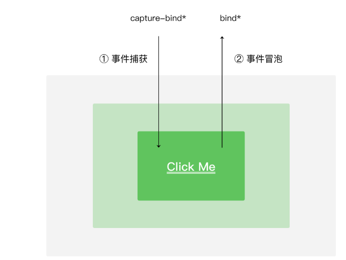
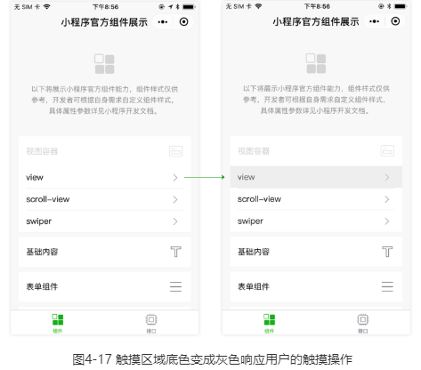
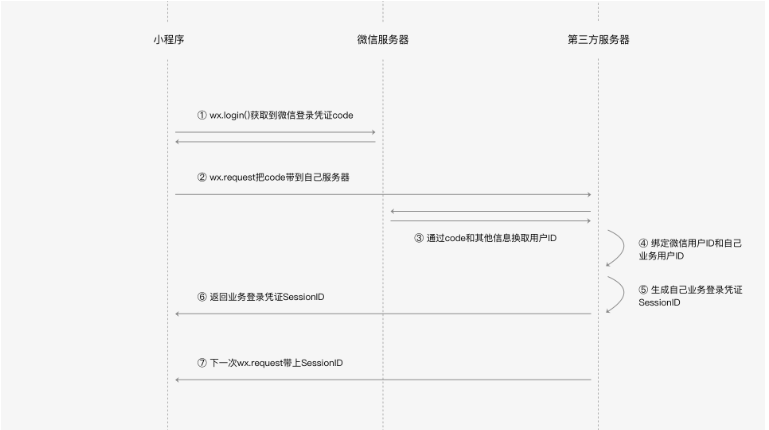

# 微信小程序

## Tips

### 生命周期

#### App

> 整个小程序只有一个 App 实例，是全部页面共享的

+ onLaunch

  + options 参数有
  
    >  onLaunch,onShow参数
  
    | 字段                   | 类型   | 描述                                                    |
    | :--------------------- | :----- | :------------------------------------------------------ |
    | path                   | String | 打开小程序的页面路径                                    |
    | query                  | Object | 打开小程序的页面参数query                               |
    | scene                  | Number | 打开小程序的场景值，详细场景值请参考小程序官方文档      |
    | shareTicket            | String | shareTicket，详见小程序官方文档                         |
    | referrerInfo           | Object | 当场景为由从另一个小程序或公众号或App打开时，返回此字段 |
    | referrerInfo.appId     | String | 来源小程序或公众号或App的 appId，详见下方说明           |
    | referrerInfo.extraData | Object | 来源小程序传过来的数据，scene=1037或1038时支持          |
  
  ```javascript
  App({
    onLaunch: function (options) {
      // 小程序启动之后 触发
    }
  })
  ```
  
+ `onShow`

  ```javascript
  App({
    // 场景值
    onLaunch: function(options) { console.log(options) },
    onShow: function(options) { console.log(options) }
  })
  
  ```

  

 App构造器的参数

| 参数属性 | 类型     | 描述                                                         |
| :------- | :------- | :----------------------------------------------------------- |
| onLaunch | Function | 当小程序初始化完成时，会触发 onLaunch（全局只触发一次）      |
| onShow   | Function | 当小程序启动，或从后台进入前台显示，会触发 onShow<br />进入小程序之后，用户可以点击右上角的关闭，或者按手机设备的Home键离开小程序，此时小程序并没有被直接销毁 |
| onHide   | Function | 当小程序从前台进入后台，会触发 onHide                        |
| onError  | Function | 当小程序发生脚本错误，或者 API 调用失败时，会触发 onError 并带上错误信息 |
| 其他字段 | 任意     | 可以添加任意的函数或数据到 Object 参数中，在App实例回调用 this 可以访问 |

#### Page

```javascript
Page({
  data: { text: "This is page data." },
  // onLoad在页面没被销毁之前只会触发1次，在onLoad的回调中，可以获取当前页面所调用的		// 打开参数option
  onLoad: function(options) { },
  // Page构造器参数所定义的onReady方法会被调用，onReady在页面没被销毁前只会触发1次，	// onReady触发时，表示页面已经准备妥当，在逻辑层就可以和视图层进行交互了
  onReady: function() { },
  // 页面显示之后，Page构造器参数所定义的onShow方法会被调用，一般从别的页面返回到当前  	// 页面时，当前页的onShow方法都会被调用
  onShow: function() { },
  // 页面不可见时，Page构造器参数所定义的onHide方法会被调用，这种情况会在使用				// wx.navigateTo切换到其他页面、底部tab切换时触发。
  onHide: function() { },
  // 当前页面使用wx.redirectTo或wx.navigateBack返回到其他页时，当前页面会被微信客	   // 户端销毁回收，此时Page构造器参数所定义的onUnload方法会被调用。
  onUnload: function() { },
  // 监听用户下拉刷新事件，需要在app.json的window选项中或页面配置page.json中设置		// enablePullDownRefresh为true。当处理完数据刷新后，wx.stopPullDownRefresh可	 // 以停止当前页面的下拉刷新。
  onPullDownRefresh: function() { },
  // 监听用户上拉触底事件。可以在app.json的window选项中或页面配置page.json中设置触		// 发距离onReachBottomDistance。在触发距离内滑动期间，本事件只会被触发一次。
  onReachBottom: function() { },
  // 只有定义了此事件处理函数，右上角菜单才会显示“转发”按钮，在用户点击转发按钮的时候会	 // 调用，此事件需要return一个Object，包含title和path两个字段，用于自定义转发内容
  onShareAppMessage: function () {
    	return {
       title: '自定义转发标题',
       path: '/page/user?id=123'
     }
  },
  // 参数为 Object，包含 scrollTop 字段，表示页面在垂直方向已滚动的距离（单位px）。
  onPageScroll: function() { }
})
```

 Page构造器的参数

| 参数属性          | 类型     | 描述                                                         |
| :---------------- | :------- | :----------------------------------------------------------- |
| data              | Object   | 页面的初始数据                                               |
| onLoad            | Function | 生命周期函数--监听页面加载，触发时机早于onShow和onReady      |
| onReady           | Function | 生命周期函数--监听页面初次渲染完成                           |
| onShow            | Function | 生命周期函数--监听页面显示，触发事件早于onReady              |
| onHide            | Function | 生命周期函数--监听页面隐藏                                   |
| onUnload          | Function | 生命周期函数--监听页面卸载                                   |
| onPullDownRefresh | Function | 页面相关事件处理函数--监听用户下拉动作                       |
| onReachBottom     | Function | 页面上拉触底事件的处理函数                                   |
| onShareAppMessage | Function | 用户点击右上角转发                                           |
| onPageScroll      | Function | 页面滚动触发事件的处理函数                                   |
| 其他              | Any      | 可以添加任意的函数或数据，在Page实例的其他函数中用 this 可以访问 |

### 列表渲染

#### 使用默认的item和index

```javascript
<!-- array 是一个数组 -->
<view wx:for="{{array}}">
  {{index}}: {{item.message}}
</view>

<!-- 对应的脚本文件
Page({
  data: {
    array: [{
      message: 'foo',
    }, {
      message: 'bar'
    }]
  }
})
-->
```

### wxml

> wxml根本就没有根节点的概念呀
>
> 一个wxml文件不必非要一个元素来包裹

### wxss

+ **[ui样式库](https://github.com/Tencent/weui-wxss)**

> 项目公共样式：根目录中的app.wxss为项目公共样式，它会被注入到小程序的每个页面。
>
> 页面样式：与app.json注册过的页面同名且位置同级的WXSS文件。

#### wxss 的引用

+ `@import url('./test_0.css')`

  > 这种方法在请求上不会把test_0.css合并到index.css中，也就是请求index.css的时候，会多一个test_0.css的请求。

+ `@import './test_0.wxss'`

  > 由于WXSS最终会被编译打包到目标文件中，用户只需要下载一次，在使用过程中不会因为样式的引用而产生多余的文件请求。

#### 内联样式

WXSS内联样式与Web开发一致:

```html
<!--index.wxml-->

<!--内联样式-->
<view style="color: red; font-size: 48rpx"></view>
```

小程序支持动态更新内联样式：

```html
<!--index.wxml-->

<!--可动态变化的内联样式-->
<!--
{
  eleColor: 'red',
  eleFontsize: '48rpx'
}
-->
<view style="color: {{eleColor}}; font-size: {{eleFontsize}}"></view>
```

#### 选择器

表2-2 小程序WXSS支持的选择器

| **类型**     | **选择器** | **样例**      | **样例描述**                                   |
| :----------- | :--------- | :------------ | :--------------------------------------------- |
| 类选择器     | .class     | .intro        | 选择所有拥有 class="intro" 的组件              |
| id选择器     | #id        | #firstname    | 选择拥有 id="firstname" 的组件                 |
| 元素选择器   | element    | view checkbox | 选择所有文档的 view 组件和所有的 checkbox 组件 |
| 伪元素选择器 | ::after    | view::after   | 在 view 组件后边插入内容                       |
| 伪元素选择器 | ::before   | view::before  | 在 view 组件前边插入内容                       |

### 使用模板

#### 在一个文件中使用

##### **定义**

> 可以在一个wxml中定义多个template

`index.wxml`

```javascript
// 在最外层节点写一样Ok
<template name="msgItem">
  <view>
    <text> {{index}}: {{msg}} </text>
    <text> Time: {{time}} </text>
  </view>
</template>

<template name="msgItem2">
  <view>
    <text> Time: {{time}} </text>
    <text> {{index}}: {{msg}} </text>
  </view>
</template>
```

##### **定义数据**

`index.js`

```javascript
data: {
		mesItem: {
      index: 0,
      msg: 'zhaosisi',
      time: '2016-06-18'
    }
}
```

##### **使用**

> 可以传递数据

`index.wxml`

+ 可以使用多次

  ```javascript
  <template is="msgItem" data="{{...mesItem}}"/>
  <template is="msgItem" data="{{...mesItem}}"/>
  ```

+ 可以使用另一个template 但是需要is来区分

  ```javascript
  <template is="msgItem2" data="{{...mesItem}}"/>
  ```

+ 可以嵌套在view中 但是却不能嵌套在text中

  ```javascript
  <view>
    <text class="text_lin">
    // 在界面是显示空白
    	<template is="msgItem" data="{{...mesItem}}"/>}
    </text>
    <template is="msgItem" data="{{...mesItem}}"/>
  </view>
  ```

#### 将template定义在别的文件然后来引入使用

##### import 引入

> 需要注意的是 import 有作用域的概念，即只会 import 目标文件中定义的 template，而不会 import 目标文件中 import 的 template，简言之就是 import 不具有递归的特性。

`component/msgItem.wxml`

```javascript
<template name="msgItem">
  <view>
    <text> {{index}}: {{msg}} </text>
    <text> Time: {{time}} </text>
  </view>
</template>
```

`index.wxml`

```javascript
<view >
  通过引用的方式引入模板
</view>
<import src="../../component/msgItem.wxml" />

<template is="msgItem" data="{{...mesItem}}"/>
```

**不会递归引入**

代码清单2-19 模板 A

```html
<!-- A.wxml -->
<template name="A">
  <text> A template </text>
</template>
```

代码清单2-20 模板 B

```html
<!-- B.wxml -->
<import src="a.wxml"/>

<template name="B">
  <text> B template </text>
</template>
```

代码清单2-21 模板 C

```html
<!-- C.wxml -->
<import src="b.wxml"/>

<template is="A"/>  <!-- 这里将会触发一个警告，因为 b 中并没有定义模板 A -->

<template is="B"/>
```

##### include 引入

> include 可以将目标文件中除了 `<template/> <wxs/>` 外的整个代码引入，相当于是拷贝到 include 位置，如代码2-22、代码2-23、代码2-24所示。

### 模块化

代码清单2-26 模块示例

```javascript
// moduleA.js
module.exports = function( value ){
  return value * 2;
}
```

代码清单2-27 引用模块A

```javascript
// B.js

// 在B.js中引用模块A
var multiplyBy2 = require('./moduleA')
var result = multiplyBy2(4)
```

代码清单2-28 在需要使用这些模块的文件中，使用 require(path) 将公共代码引入

```javascript
var common = require('common.js')
Page({
  helloMINA: function() {
    common.sayHello('MINA')
  },
  goodbyeMINA: function() {
    common.sayGoodbye('MINA')
  }
})
```

### 页面跳转

#### 页面栈

> 一个小程序拥有多个页面，我们可以通过wx.navigateTo推入一个新的页面，如图3-6所示，在首页使用2次wx.navigateTo后，页面层级会有三层，我们把这样的一个页面层级称为页面栈。


#### 跳转方法

+ `navigateTo` 带参数跳转

  > ```javascript
  > // 列表页使用navigateTo跳转到详情页
  > wx.navigateTo({ url: 'pages/detail/detail?id=1&other=abc' })
  > ```

  **获取页面上的参数**

  > 页面URL上的value如果涉及特殊字符（例如：&字符、?字符、中文字符等，详情参考URI的RFC3986说明 ），需要采用UrlEncode后再拼接到页面URL上。

  ```javascript
  // pages/detail/detail.js
  Page({
    onLoad: function(option) {
          console.log(option.id)
          console.log(option.other)
    }
  })
  ```

+ `wx.navigateBack() `

  > 可以退出当前页面栈的最顶上页面

+ `wx.redirectTo({ url: 'pageE' })`

  > 是替换当前页变成pageE
  >
  > 当页面栈到达10层没法再新增的时候，往往就是使用redirectTo这个API进行页面跳转。

+ `wx.switchTab({ url: 'pageF' })`

  > 所在的页面栈中使用wx.switchTab({ url: 'pageF' })，
  >
  > **此时原来的页面栈会被清空（除了已经声明为Tabbar页pageA外其他页面会被销毁）**，然后会切到pageF所在的tab页面，页面栈变成 [ pageF ]

  ```javascript
  {
    "tabBar": {
      "list": [
        { "text": "Tab1", "pagePath": "pageA" },
        { "text": "Tab1", "pagePath": "pageF" },
        { "text": "Tab1", "pagePath": "pageG" }
      ]
    }
  }
  ```

##### 注意

+ **wx.navigateTo和wx.redirectTo只能打开非TabBar页面，wx.switchTab只能打开Tabbar页面。**

页面路由触发方式及页面生命周期函数的对应关系

| 路由方式        | 触发时机                   | 路由前页面生命周期 | 路由后页面生命周期 |
| :-------------- | :------------------------- | :----------------- | :----------------- |
| 初始化          | 小程序打开的第一个页面     |                    | onLoad, onShow     |
| 打开新页面 调用 | API wx.navigateTo          | onHide             | onLoad, onShow     |
| 页面重定向 调用 | API wx.redirectTo          | onUnload           | onLoad, onShow     |
| 页面返回 调用   | API wx.navigateBack        | onUnload           | onShow             |
| Tab             | 切换 调用 API wx.switchTab | 请参考表3-6        | 请参考表3-6        |
| 重启动          | 调用 API wx.reLaunch       | onUnload           | onLoad, onShow     |

### 页面数据

#### setData

> setData(data, callback)

> 宿主环境所提供的Page实例的原型中有setData函数，我们可以在Page实例下的方法调用this.setData把数据传递给渲染层，从而达到更新界面的目的。

> 由于小程序的渲染层和逻辑层分别在两个线程中运行，所以setData传递数据实际是一个异步的过程，所以setData的第二个参数是一个callback回调，在这次setData对界面渲染完毕后触发。

```javascript
// page.js
Page({
  onLoad: function(){
    this.setData({
      text: 'change data'
    }, function(){
      // 在这次setData对界面渲染完毕后触发
    })
  }
})
```

### 事件

####  常见的事件类型

| 类型               | 触发条件                                                     |
| :----------------- | :----------------------------------------------------------- |
| touchstart         | 手指触摸动作开始                                             |
| touchmove          | 手指触摸后移动                                               |
| touchcancel        | 手指触摸动作被打断，如来电提醒，弹窗                         |
| touchend           | 手指触摸动作结束                                             |
| tap                | 手指触摸后马上离开                                           |
| longpress          | 手指触摸后，超过350ms再离开，如果指定了事件回调函数并触发了这个事件，tap事件将不被触发 |
| longtap            | 手指触摸后，超过350ms再离开（推荐使用longpress事件代替）     |
| transitionend      | 会在 WXSS transition 或 wx.createAnimation 动画结束后触发    |
| animationstart     | 会在一个 WXSS animation 动画开始时触发                       |
| animationiteration | 会在一个 WXSS animation 一次迭代结束时触发                   |
| animationend       | 会在一个 WXSS animation 动画完成时触发                       |

#### 事件对象

事件对象属性

| 属性           | 类型    | 说明                                         |
| :------------- | :------ | :------------------------------------------- |
| type           | String  | 事件类型                                     |
| timeStamp      | Integer | 页面打开到触发事件所经过的毫秒数             |
| target         | Object  | 触发事件的组件的一些属性值集合               |
| currentTarget  | Object  | 当前组件的一些属性值集合                     |
| detail         | Object  | 额外的信息                                   |
| touches        | Array   | 触摸事件，当前停留在屏幕中的触摸点信息的数组 |
| changedTouches | Array   | 触摸事件，当前变化的触摸点信息的数组         |

##### target和currentTarget的区别

`currentTarget`为当前事件所绑定的舰

`target`则是触发该事件的源头组件

```javascript
<!-- page.wxml -->
<view id="outer" catchtap="handleTap">
  <view id="inner">点击我</view>
</view>
```

```javascript
// page.js
Page({
  handleTap: function(evt) {
       // 当点击inner节点时
    // evt.target 是inner view组件
       // evt.currentTarget 是绑定了handleTap的outer view组件
      
     
       // evt.type == “tap”
       // evt.timeStamp == 1542
       // evt.detail == {x: 270, y: 63}
       // evt.touches == [{identifier: 0, pageX: 270, pageY: 63, clientX: 270, clientY: 63}]
       // evt.changedTouches == [{identifier: 0, pageX: 270, pageY: 63, clientX: 270, clientY: 63}]
  }
})
```

#### 事件的绑定与冒泡获取

> 事件绑定的写法和组件属性一致，以key="value"的形式，其中：
>
> bindtap、catchtouchstart
>
> 基础库版本1.5.0起，bind和catch后可以紧跟一个冒号，其含义不变，如bind:tap、catch:touchstart



##### 事件的捕获（从外向内）

```javascript
<view
  id="outer"
  bind:touchstart="handleTap1"
  capture-bind:touchstart="handleTap2"
>
  outer view
  <view
    id="inner"
    bind:touchstart="handleTap3"
    capture-bind:touchstart="handleTap4"
  >
    inner view
  </view>
</view>
```

> 执行顺序
>
> ```javascript
> handleTap2 -> handleTap4 -> handleTap3 -> handleTap2
> ```
>
> 如果`capture-bind:touchstart="handleTap2"`改写成`capture-cath:touchstart="handleTap2"` 
>
> 那么 智慧之u行handleTap2 因为 事件已经被截断了

### 获取宿主环境 获取手机型号

```javascript
wx.getSystemInfoSync()
/*
  {
    brand: "iPhone",      // 手机品牌
    model: "iPhone 6",    // 手机型号
    platform: "ios",      // 客户端平台
    system: "iOS 9.3.4",  // 操作系统版本
    version: "6.5.23",    // 微信版本号
    SDKVersion: "1.7.0",  // 小程序基础库版本
    language: "zh_CN",    // 微信设置的语言
    pixelRatio: 2,        // 设备像素比
    screenWidth: 667,    // 屏幕宽度
    screenHeight: 375,     // 屏幕高度
    windowWidth: 667,    // 可使用窗口宽度
    windowHeight: 375,     // 可使用窗口高度
    fontSizeSetting: 16   // 用户字体大小设置
  }
 */
```

### 界面创建的交互反馈

#### 触摸反馈



**通过hover-class属性改变触摸时的样式**

```javascript
/*page.wxss */

.hover{

  background-color: gray;

}


<!--page.wxml -->

<button hover-class="hover"> 点击button </button>

<view hover-class="hover"> 点击view</view>
```

**通过button的loading来提示用户的等待**

```javascript
<!--page.wxml -->

<button loading="{{loading}}" bindtap="tap">操作</button>


//page.js

Page({

  data: { loading: false },

  tap: function() {

    // 把按钮的loading状态显示出来

    this.setData({

      loading: true

    })

    // 接着做耗时的操作

  }

})
```

#### Toast和模态对话框

**Tost**

```javascript
Page({

  onLoad: function() {

    wx.showToast({ // 显示Toast

      title: '已发送',

      icon: 'success',

      duration: 1500

    })

    // wx.hideToast() // 隐藏Toast

  }

})
```

**模态对话框**

```javascript
Page({

  onLoad: function() {

    wx.showModal({

      title: '标题',

      content: '告知当前状态，信息和解决方法',

      confirmText: '主操作',

      cancelText: '次要操作',

      success: function(res) {

        if (res.confirm) {

          console.log('用户点击主操作')

        } else if (res.cancel) {

          console.log('用户点击次要操作')

        }

      }

    })

  }

})
```

#### 下拉刷新

```javascript
//page.json

{"enablePullDownRefresh": true }


//page.js

Page({

  onPullDownRefresh: function() {

    // 用户触发了下拉刷新操作

    // 拉取新数据重新渲染界面

    // wx.stopPullDownRefresh() // 可以停止当前页面的下拉刷新。

  }

})
```

#### 上拉触底

```javascript
//page.json

// 界面的下方距离页面底部距离小于onReachBottomDistance像素时触发onReachBottom回调

{"onReachBottomDistance": 100 }


//page.js

Page({

  onReachBottom: function() {

    // 当界面的下方距离页面底部距离小于100像素时触发回调

  }

})
```

### 发起HTTPS网络请求

代码清单4-7 wx.request调用示例

```javascript
wx.request({

  url: 'https://test.com/getinfo',

  success: function(res) {

    console.log(res)// 服务器回包信息

  }

})
```

 wx.request详细参数

| **参数名** | **类型**      | **必填** | **默认值** | **描述**                                                     |
| :--------- | :------------ | :------- | :--------- | :----------------------------------------------------------- |
| url        | String        | 是       |            | 开发者服务器接口地址                                         |
| data       | Object/String | 否       |            | 请求的参数                                                   |
| header     | Object        | 否       |            | 设置请求的 header，header 中不能设置 Referer，默认header['content-type'] = 'application/json' |
| method     | String        | 否       | GET        | （需大写）有效值：OPTIONS, GET, HEAD, POST, PUT, DELETE, TRACE, CONNECT |
| dataType   | String        | 否       | json       | 回包的内容格式，如果设为json，会尝试对返回的数据做一次 JSON解析 |
| success    | Function      | 否       |            | 收到开发者服务成功返回的回调函数，其参数是一个Object，见表4-2。 |
| fail       | Function      | 否       |            | 接口调用失败的回调函数                                       |
| complete   | Function      | 否       |            | 接口调用结束的回调函数（调用成功、失败都会执行）             |

```
var hasClick = false;

Page({

  tap: function() {

    if (hasClick) {

      return

    }

    hasClick = true

    wx.showLoading()


    wx.request({

      url: 'https://test.com/getinfo',

      method: 'POST',

      header: { 'content-type':'application/json' },

      data: { 
      	a: {

          b: [1, 2, 3],

          c: { d: "test" }

        }
      },

      success: function (res) {

        if (res.statusCode === 200) {

          console.log(res.data)// 服务器回包内容

        }

      },

      fail: function (res) {

        wx.showToast({ title: '系统错误' })

      },

      complete: function (res) {

        wx.hideLoading()

        hasClick = false

      }

    })

  }

})
```

### 微信登录



#### 获取微信登录凭证code

+ wx.login是生成一个带有时效性的凭证，就像是一个会过期的临时身份证一样,只有5分钟时间
+ 如果5分钟内小程序的后台不拿着这个临时身份证来微信后台服务器换取微信用户id的话，那么这个身份证就会被作废，需要再调用wx.login重新生成登录凭证。

#### 发送code到开发者服务器

```javascript
login ({ commit }) {
    return new Promise((resolve, reject) => {
      wx.login({
        success: (res) => {
          commit('GET_INIT_CODE', res.code)
            // 把code给到自己的后端服务器后，后端服务器
            // 通过这个code取拿到用户的唯一id
          api.getAuthenticate(state.appId, {
            code: state.code
          }).then(data => {
            if (data.data.code === 0) {
              commit('GET_OPEN_ID', data.data)
              wx.setStorage({
                key: 'token',
                data: data.data.data.token,
                success: function () {
                  resolve(data)
                }
              })
            }
          }).catch(err => {
            reject()
            console.log(err)
          })
        }
      })
    })
  }
```

### 本地数据缓存

#### 读写本地数据缓存

+ wx.getStorage

  > **读数据**
  >
  > 异步缓存，需要回调才能拿到缓存的数据
  >
  > ```javascript
  > // 读取数据
  > wx.getStorage({
  > 
  >   key: 'key1',
  > 
  >   success: function(res) {
  > 
  >     // 异步接口在success回调才能拿到返回值
  > 
  >     var value1 = res.data
  > 
  >   },
  > 
  >   fail: function() {
  > 
  >     console.log('读取key1发生错误')
  > 
  >   }
  > 
  > })
  > ```
  >
  > **写数据**
  >
  > ```javascript
  > // 异步接口在success/fail回调才知道写入成功与否
  > 
  > wx.setStorage({
  > 
  >   key:"key",
  > 
  >   data:"value1"
  > 
  >   success: function() {
  > 
  >     console.log('写入value1成功')
  > 
  >   },
  > 
  >   fail: function() {
  > 
  >     console.log('写入value1发生错误')
  > 
  >   }
  > 
  > })
  > ```

+ `wx.getStorageSync`

  > **读取数据**
  >
  > 同步缓存
  >
  > ```javascript
  > // 读取数据
  > try{
  > 
  >   // 同步接口立即返回值
  > 
  >   var value2 = wx.getStorageSync('key2')
  > 
  > }catch (e) {
  > 
  >   console.log('读取key2发生错误')
  > 
  > }
  > ```
  >
  > **写数据**
  >
  > ```javascript
  > try{
  > 
  >   // 同步接口立即写入
  > 
  >   wx.setStorageSync('key', 'value2')
  > 
  >   console.log('写入value2成功')
  > 
  > }catch (e) {
  > 
  >   console.log('写入value2发生错误')
  > 
  > }
  > ```

wx.setStorage/wx.setStorageSync详细参数

**读数据**

| **参数名** | **类型** | **必填** | **描述**                                                     |
| :--------- | :------- | :------- | :----------------------------------------------------------- |
| key        | String   | 是       | 本地缓存中指定的 key                                         |
| success    | Function | 否       | 异步接口调用成功的回调函数，回调参数格式: {data: key对应的内容} |
| fail       | Function | 否       | 异步接口调用失败的回调函数                                   |
| complete   | Function | 否       | 异步接口调用结束的回调函数（调用成功、失败都会执行）         |

**写数据**

| **参数名** | **类型**      | **必填** | **描述**                                             |
| :--------- | :------------ | :------- | :--------------------------------------------------- |
| key        | String        | 是       | 本地缓存中指定的 key                                 |
| data       | Object/String | 是       | 需要存储的内容                                       |
| success    | Function      | 否       | 异步接口调用成功的回调函数                           |
| fail       | Function      | 否       | 异步接口调用失败的回调函数                           |
| complete   | Function      | 否       | 异步接口调用结束的回调函数（调用成功、失败都会执行） |

### 设备能力

#### 扫码能力

```javascript
//page.js

Page({

  // 点击“扫码订餐”的按钮，触发tapScan回调

  tapScan: function() {

    // 调用wx.login获取微信登录凭证

    wx.scanCode({

      success: function(res) {

        var num = res.result // 获取到的num就是餐桌的编号

      }

    })

  }

})
```

#### 获取网络状态 及 下载和预览文档

```javascript
//page.js

Page({

  // 点击“预览文档”的按钮，触发tap回调

  tap: function() {

    wx.getNetworkType({

      success: function(res) {

        // networkType字段的有效值：

        // wifi/2g/3g/4g/unknown(Android下不常见的网络类型)/none(无网络)

        if (res.networkType == 'wifi') {

          // 从网络上下载pdf文档

          wx.downloadFile({

            url:'http://test.com/somefile.pdf',

            success: function (res) {

              // 下载成功之后进行预览文档

              wx.openDocument({

                filePath: res.tempFilePath

              })

            }

          })

        } else {

          wx.showToast({ title: '当前为非Wifi环境' })

        }

      }

    })

  }

})
```

### 页面层级准备

> 在视图层内，小程序的每一个页面都独立运行在一个页面层级上。小程序启动时仅有一个页面层级，每次调用wx.navigateTo，都会创建一个新的页面层级；
>
> 相对地，wx.navigateBack会销毁一个页面层级。

+ 对于wx.redirectTo，这个调用不会打开一个新的页面层级，而是将当前页面层级重新初始化：重新传入页面的初始数据、路径等，**视图层清空当前页面层级的渲染结果然后重新渲染页面。**

###  版本号比较

```javascript
function compareVersion(v1, v2) {
  v1 = v1.split('.')
  v2 = v2.split('.')
  var len = Math.max(v1.length, v2.length)

  while (v1.length < len) {
    v1.push('0')
  }
  while (v2.length < len) {
    v2.push('0')
  }

  for (var i = 0; i < len; i++) {
    var num1 = parseInt(v1[i])
    var num2 = parseInt(v2[i])

    if (num1 > num2) {
      return 1
    } else if (num1 < num2) {
      return -1
    }
  }
  return 0
}

compareVersion('1.11.0', '1.9.9') // => 1 // 1表示 1.11.0比1.9.9要新
compareVersion('1.11.0', '1.11.0') // => 0 // 0表示1.11.0和1.11.0是同一个版本
compareVersion('1.11.0', '1.99.0') // => -1 // -1表示1.11.0比 1.99.0要老
```

## 目录结构

小程序包含一个描述整体程序的 `app` 和多个描述各自页面的 `page`。

一个小程序主体部分由三个文件组成，必须放在项目的根目录，如下：

| 文件                                                         | 必需 | 作用             |
| :----------------------------------------------------------- | :--- | :--------------- |
| [app.js](https://developers.weixin.qq.com/miniprogram/dev/framework/app-service/app.html) | 是   | 小程序逻辑       |
| [app.json](https://developers.weixin.qq.com/miniprogram/dev/framework/config.html) | 是   | 小程序公共配置   |
| [app.wxss](https://developers.weixin.qq.com/miniprogram/dev/framework/view/wxss.html) | 否   | 小程序公共样式表 |

一个小程序页面由四个文件组成，分别是：

| 文件类型                                                     | 必需 | 作用       |
| :----------------------------------------------------------- | :--- | :--------- |
| [js](https://developers.weixin.qq.com/miniprogram/dev/framework/app-service/page.html) | 是   | 页面逻辑   |
| [wxml](https://developers.weixin.qq.com/miniprogram/dev/framework/view/wxml/) | 是   | 页面结构   |
| [json](https://developers.weixin.qq.com/miniprogram/dev/framework/config.html#页面配置) | 否   | 页面配置   |
| [wxss](https://developers.weixin.qq.com/miniprogram/dev/framework/view/wxss.html) | 否   | 页面样式表 |

**注意：为了方便开发者减少配置项，描述页面的四个文件必须具有相同的路径与文件名。**

## 配置小程序

## 自定义组件

### 自定义全局组件

`App.json`

```javascript
...
"usingComponents": {
    "cu-custom": "/colorui/components/cu-custom"
  }
...
```

